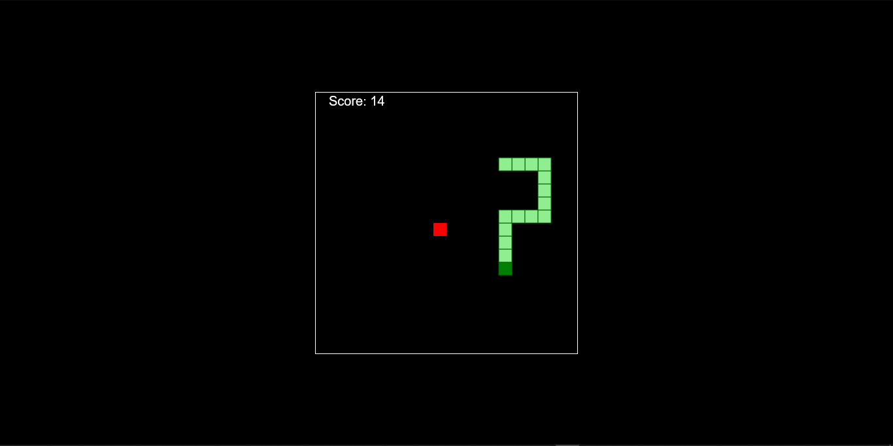

# Snake Game with A* Pathfinding

A classic Snake game built using JavaScript, HTML, and CSS. This version of the game incorporates the A* algorithm for intelligent pathfinding, allowing the snake to find optimal paths to its target (the food). This project demonstrates basic game mechanics with the use of AI techniques.


---

## Table of Contents

- [Features](#features)
- [Screenshots](#screenshots)
- [Game Mechanics](#game-mechanics)
- [A* Pathfinding](#a-pathfinding)
- [Tech Stack](#tech-stack)
- [Installation](#installation)

---

## Features

- **A\* Pathfinding Algorithm**: AI-controlled mode where the snake automatically finds the shortest path to the food using the A* algorithm.


---

## Screenshots

### Game Play


---

## Game Mechanics

- **Snake Movement**: snake moves autonomously using A* pathfinding.
- **Food Collection**: Every time the snake eats food, it grows longer and gains points.
- **Game Over**: The game ends if the snake runs into itself or the walls.
---

## A* Pathfinding

The A* algorithm is used in AI mode to navigate the snake efficiently towards the food. A* is a popular pathfinding algorithm that finds the shortest path by evaluating both the cost of moving to the next cell and the estimated distance to the target.

### How It Works

- **Grid Representation**: The game area is divided into a grid where each cell represents a possible position for the snake.
- **Heuristic**: A* uses a heuristic (Manhattan distance) to estimate the shortest path to the target (food).
- **Avoiding Obstacles**: The algorithm considers the snake’s body and walls as obstacles to avoid collisions.
- **Real-time Updates**: As the snake moves, A* recalculates the best path to reach the food.

## Tech Stack

- **Frontend**: HTML5, CSS3, JavaScript (Vanilla JS)
- **Algorithm**: A* pathfinding for AI-controlled movement

---

## Installation

### Prerequisites
- Modern web browser (Chrome, Firefox, Safari, etc.)

### Steps

1. **Clone the Repository**
   ```bash
   git clone https://github.com/bijuaryal91/SnakeAI.git
   cd SnakeAI

2. **Open the game**
 Simply open index.html in your preferred web browser to start playing.

